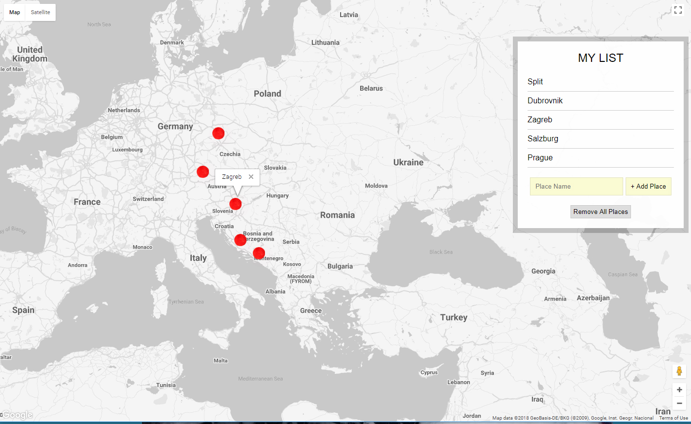

Places Project: Google Maps API
=====================================

I love maps and geography. Always have. This is a personal project to help me gain a better understanding of what's possible with the 
Google Maps JavaScript API.  
  
I created an interactive map using google's places library. The user can enter a place in the search box which then places markers on 
the map and lists those places in the browser.  

Getting started
----------------------------------------
No requirements or dependencies.
Just clone repo and open in browser

What I learned
-----------------------------------------

Some things I learned while creating this:
- what libraries are available with the google maps api- places, visualization, drawing, and geometry
- better understanding of scoping in JavaScript
- how to work with local storage
- limitations to storing circular structures in local storage
- continuing to improve my approach to solving errors and fixing bugs

